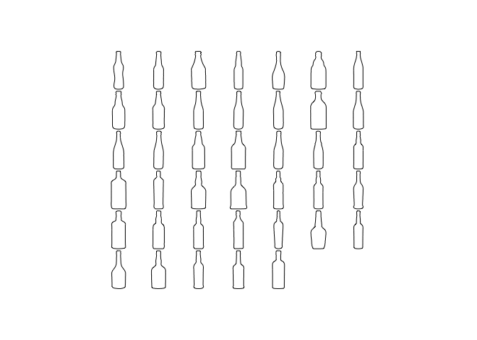

<!-- README.md is generated from README.Rmd. Please edit that file -->
Momosaics
=========

Momosaics uses primitive layers to draw many shapes or subplots as mosaics of plots.

Installation
------------

You can install Momosaics from github with:

``` r
# install.packages("devtools")
devtools::install_github("vbonhomme/Momosaics")
```

Example
-------

``` r
# First load Momosaics
library(Momosaics)
# To benefit its datasets
library(Momocs)
mosaic_wrap(bot$coo) %>% 
  mosaic_empty_plot() %>% 
  add_outlines()
```



``` r
mosaic_wrap_factor(bot$coo, bot$fac$type) %>% 
  mosaic_empty_plot() %>% 
  add_outlines(col=palettize(bot$fac$type, col_summer)) %>% 
  add_text() %>% 
  add_headers()
```


More to come.
